# Part 2 — Product Understanding: the AbleSpace "Take Data" screen

**Author:** Akash Kalyan
**Explored:** 20 Aug 2026, `app.ablespace.io/caseload` → Take Data
**Environment:** Brave on Windows, desktop viewport ≈ 1568 × 700, account plan **Basic**

I walked the screen end to end with the two demo students on the account: I opened a
session, captured real data against three different goal types, opened every tab and
modal in the session, then followed the data back out to the Data page to confirm where
it lands. Everything below is what I actually observed, not what I assume a
data-collection tool does.

All screenshots are from that session, cropped to the application area.

---

## 1. What this screen is for

AbleSpace is an IEP goal-tracking app for school-based clinicians — speech therapists,
occupational therapists, special educators. Their working day is a series of short
sessions with students, and during each session they have to record how the student
performed against that student's IEP goals.

That recording is not busywork. IEP data is a legal and funding artifact: it drives
progress reports, eligibility reviews, and billing. So the "Take Data" screen has an
unusually demanding job — it has to be fast enough to use *while* running a therapy
session with a child in front of you, and rigorous enough that the numbers hold up in a
compliance review months later.

Understanding that tension is the key to reading the design. Almost every decision on the
screen is a trade between speed-in-the-moment and rigour-after-the-fact.

---

## 2. Where the workflow starts: Caseload

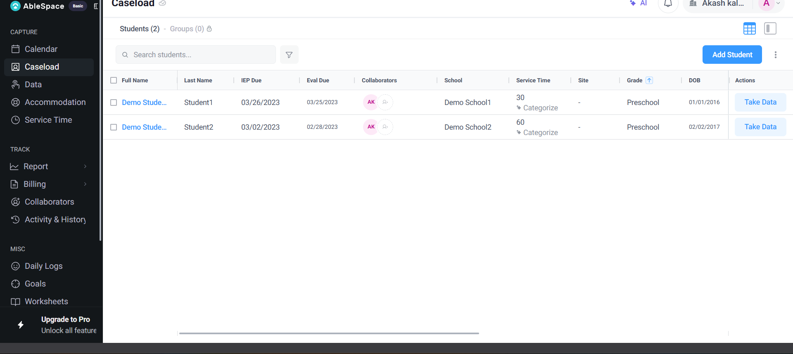

The **Caseload** tab is the clinician's roster. Each row is a student, and the columns are
the things a clinician needs at a glance: **IEP Due** and **Eval Due** (compliance
deadlines), **Collaborators** (who else works with this student), **Service Time** (the
minutes owed per week), **School**, **Site**, **Grade**, **DOB**.

There are two tabs — **Students (2)** and **Groups (0)** — with Groups padlocked on the
Basic plan. The right-hand **Actions** column carries the primary verb for the whole app:
**Take Data**.

This is a good information-architecture decision. The clinician's mental model is
"who am I seeing next?", not "which form do I open?", so the roster is the front door and
data capture hangs off each person.

---

## 3. Clicking "Take Data" opens a session, not a form

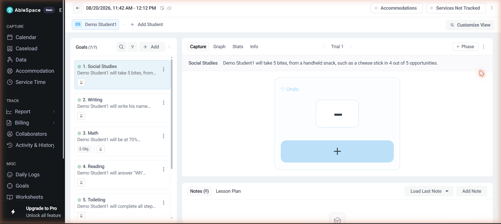

Take Data navigates to `/session/:sessionId`. That URL matters: a session is a real,
addressable object, not a modal. The header shows a **date and time range**
(`08/20/2026, 11:42 AM – 12:12 PM` in the screenshot) that is editable, so a session has a duration — which
is what service-time and billing later depend on.

The workspace has three regions:

- **Student strip** — the student you came in for, plus **+ Add Student**. One session can
  hold several students, which is how group therapy actually works.
- **Goal list (left)** — every goal on that student's IEP, numbered, with the goal area
  (Social Studies, Writing, Math, Reading, Toileting, Behavior…), the goal text, a small
  hourglass **timer** badge, and a `2 Obj.` badge where a goal has sub-objectives.
- **Capture panel (right)** — tabs **Capture / Graph / Stats / Info**, a trial pager
  (`‹ Trial 1 ›`), and **+ Phase**.

Underneath sits **Notes / Lesson Plan**, with a **Load Last Note** shortcut — a small
touch that recognises session notes are often near-duplicates of last week's.

---

## 4. The core insight: the capture control changes per goal

This is the most important thing about the screen, and it only became clear after clicking
through several goals. **The measurement type is a property of the goal**, and the capture
UI re-renders to match. I found three distinct types on a single student:

### Frequency count — "will take 5 bites…"

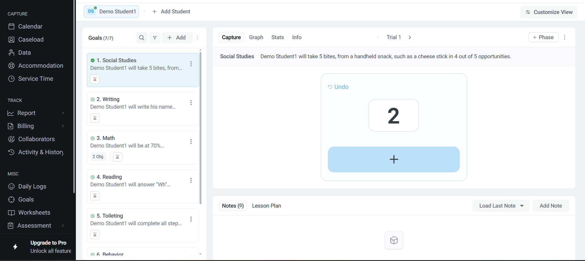

A single large **+** button, a running total, and **Undo**. You tap once per occurrence.
Nothing else on screen competes for attention.

### Task analysis — "will write his name legibly…"

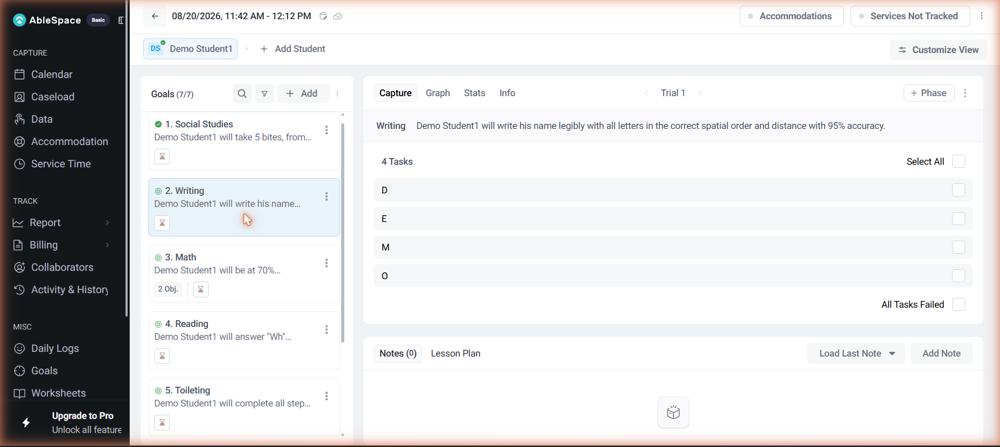

The goal decomposes into steps — here the letters **D, E, M, O** — each with a checkbox,
plus **Select All** and **All Tasks Failed** shortcuts. This is how you score a chained
skill where partial completion is the point.

### Trial-by-trial accuracy — "will be at 70% proficiency…"

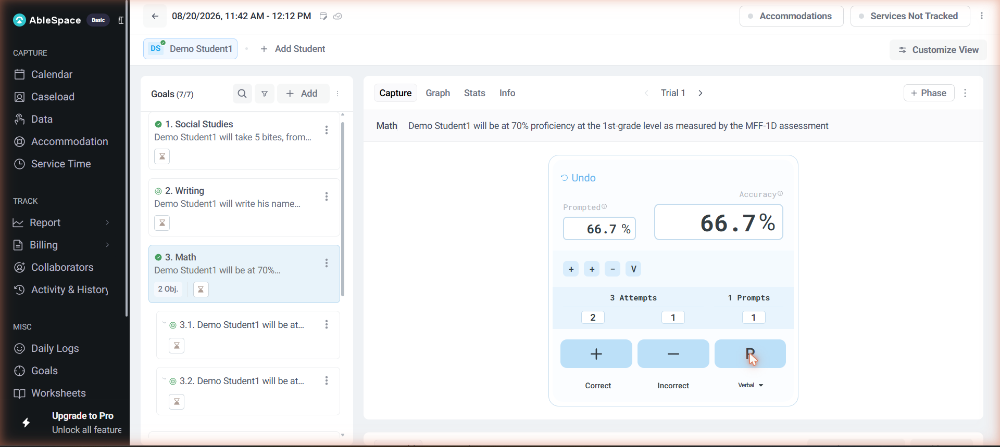

The richest one. Three buttons: **+ Correct**, **— Incorrect**, and **P** for a prompted
trial, with a dropdown to choose the prompt level (Cue, Prompt, Model, Verbal, Visual,
Physical, Tactile, Written…). Above them:

- a **history strip** showing the literal sequence of the session — `+ + − V`
- editable counters: **3 Attempts**, **1 Prompts**, broken out as correct / incorrect / prompts
- two live percentages: **Prompted** and **Accuracy**

I scored two correct, one incorrect, then one verbal-prompted trial, and confirmed that a
prompted trial increments **Prompts** without incrementing **Attempts** — prompts are
tracked as a parallel dimension, not as another attempt. That is clinically correct:
independence is the thing being measured, and a prompted success is not an independent one.

---

## 5. Analysis lives in the same screen as capture

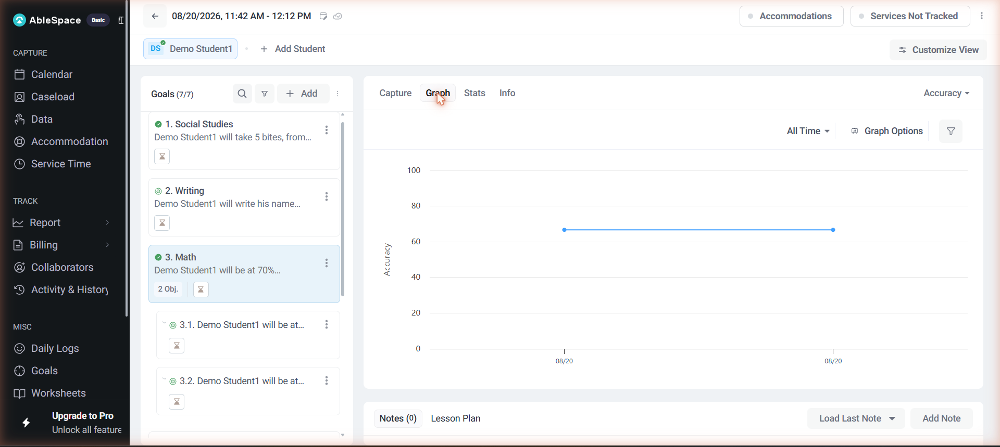

**Graph** plots the selected metric over time with a range selector and graph options.
**Stats** is the underlying table — one row per session/trial, with who edited it, plus
**+ Add Data** for retroactive entry and **Download** for export. **Info** summarises the
goal: measurement type, last updated, data-point count, note count.

Being able to check "is this child actually progressing?" without leaving the capture
screen is genuinely useful — that question tends to arise mid-session, when you are
deciding whether to keep going or change the plan.

---

## 6. The wrap-around: attendance, service time, accommodations

Two header buttons handle the compliance layer:

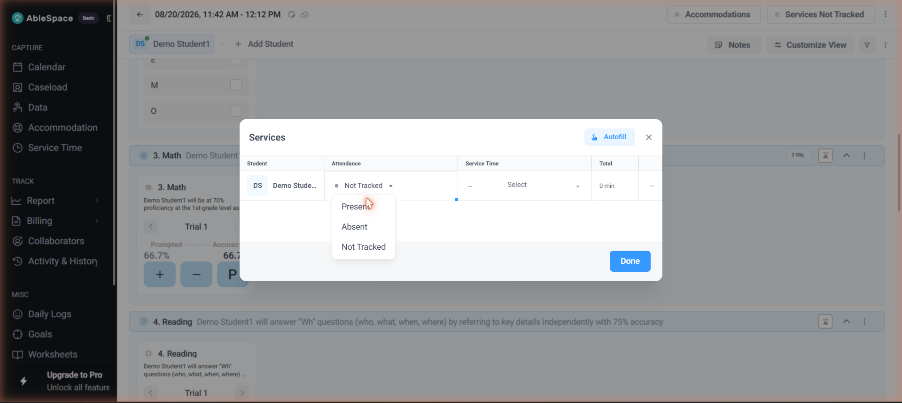

- **Services (Not Tracked)** — attendance (**Present / Absent / Not Tracked**), service
  time, and a computed total, with an **Autofill** shortcut. This is what feeds billing.
- **Accommodations** — which supports were in place, per student.

---

## 7. Saving: there isn't a save button

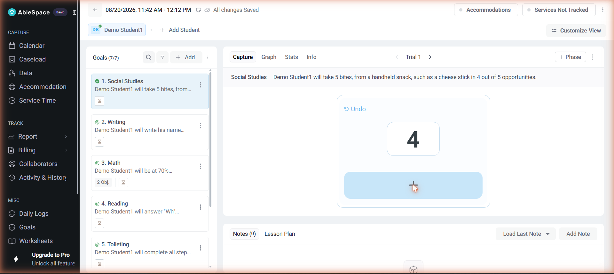

There is no Save or Submit anywhere. The app autosaves and briefly shows **"All changes
Saved"** next to the session time. I verified this properly by hard-reloading the session
URL — the count I had entered was still there.

Progress is also signalled ambiently: capturing anything against a goal flips that goal's
icon to a **green check**, and the student chip picks up a check badge too. So the goal
list doubles as a "what have I still not scored?" checklist.

---

## 8. Layout is configurable per session

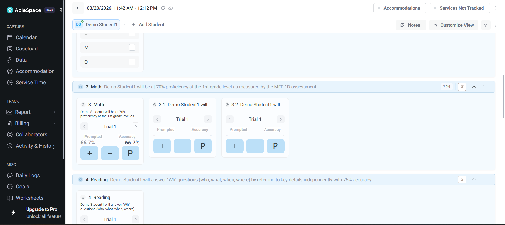

**Customize View** offers **List / Board / Group** layouts, a **Compact View** toggle, and
show/hide switches for **Instructions** and **Data Collection Buttons**, with **Set as
Default View**. Board renders every goal stacked with its capture widget inline, so you can
score without selecting a goal first — sensible for a fast-moving session where you bounce
between targets.

---

## 9. Where the data ends up

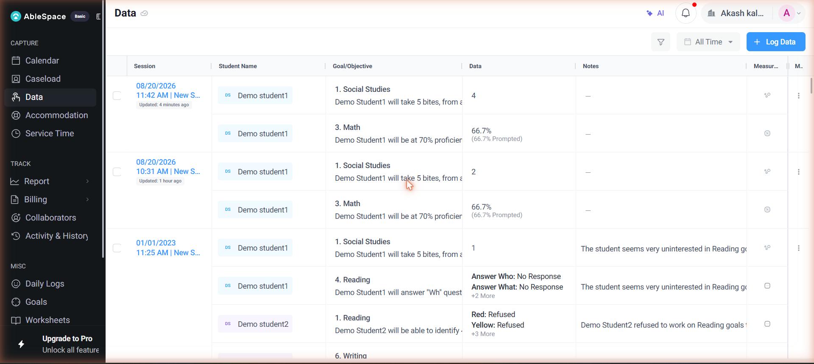

Sidebar → **Data** aggregates everything by session. Both of that morning's sessions are
visible: my captures appear as `4` for the count goal and `66.7% (66.7% Prompted)` for the
accuracy goal. Other measurement types
render as key/value lists (`Answer Who: No Response, Answer What: No Response, +2 More`).
**+ Log Data** allows entry outside a session.

**The full loop:** Caseload → Take Data → session (capture per goal, per trial) → autosave
→ Data → Reports.

---

## 10. What the screen gets right

Worth stating plainly, because these are deliberate and not easy:

1. **Measurement type belongs to the goal.** One screen absorbs frequency, task analysis
   and trial-by-trial scoring without the clinician configuring anything mid-session.
2. **Prompts as a separate dimension.** Keeping prompts out of the attempt count preserves
   the independence signal that IEP goals are actually written around.
3. **Sessions are first-class and addressable.** A session has an id, a duration, students,
   attendance and notes — which is what makes billing and audit possible later.
4. **Autosave.** The correct call for an app used one-handed while supervising a child.
5. **Capture and analysis in one place**, so instructional decisions can happen live.
6. **The goal list doubles as a progress checklist** via the green-check state.

---

## 11. Improvements I would make

Ordered by how much I think they matter. Each is tied to something I actually hit.

### UX / UI

**1. "Prompted" and "Accuracy" are too easy to confuse — high impact**
The tooltips define **Accuracy** as *correct without prompts ÷ attempts* and **Prompted**
as *correct ÷ attempts*. But the label "Prompted" reads as "the percentage of trials that
were prompted", which is a different and equally plausible number. Worse, in my session
both boxes read **66.7%**, so the distinction was invisible at exactly the moment I needed
to understand it.
*Fix:* rename to **Independent accuracy** and **Accuracy with prompts** — the Stats panel
already uses "Independent Accuracy", so this also makes the app internally consistent.
A fraction under each would not be enough on its own: in my session both resolve to `2/3`,
because a prompted trial increments Prompts without producing a correct attempt, so the
two numbers only diverge once a prompted *success* is recorded. The figure that actually
carries the signal is the prompt count, so surface it alongside them —
`2/3 independent · 1 prompted` — rather than two percentages that are frequently identical.

**2. Prompt-level codes collide — high impact**

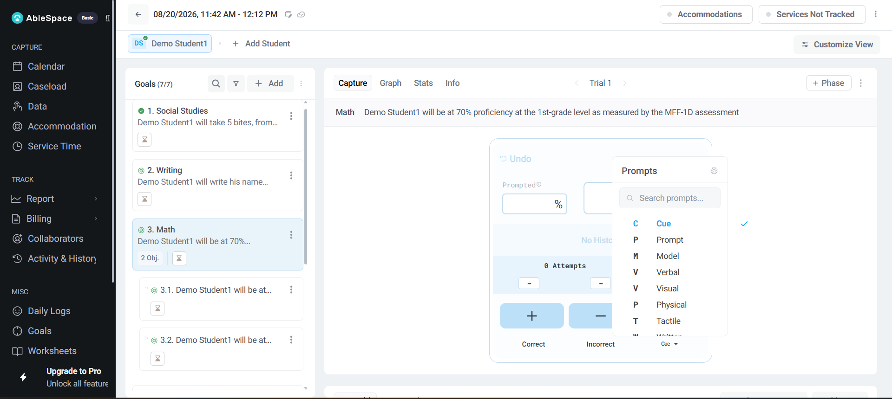

The dropdown offers **V**erbal and **V**isual, and **P**rompt and **P**hysical. The history
strip records a single letter, so `V` is ambiguous on review — and that strip is the
clinician's audit trail of what actually happened.
*Fix:* two-letter codes (`Vb` / `Vs`, `Pr` / `Ph`), or letter plus colour, and show the
full prompt name on hover in the history strip.

**3. Accuracy renders inconsistently between rows — medium**
In Stats, historical rows show Accuracy as `—` with a prompted figure in brackets, while
the row I captured today shows `66.7%`. If that is plan-gating — the Performance Summary
blurs "Independent Accuracy" behind *Unlock with free trial* — then it is inconsistent,
because the Capture tab shows the same number live and unblurred.
*Fix:* gate a metric everywhere or nowhere. A number that appears in one panel and is
blurred in another reads as a bug, and it undermines trust in the data.

**4. Compliance dates are styled as ordinary text — medium**
On Caseload, both demo students have IEP and Eval dates in **2023** — long overdue — and
they render in the same grey as every other cell. Missed IEP deadlines carry real legal
consequence; this is the highest-stakes information on the roster.
*Fix:* colour-code by urgency (overdue / due within 30 days), add a "due soon" filter, and
sort by nearest deadline by default.

**5. Board view wastes most of the horizontal space — medium**
Each capture card is roughly 200px wide inside a ~1300px row, leaving a large empty gutter,
so a seven-goal session scrolls far more than it needs to.
*Fix:* flow the cards into a responsive multi-column grid.

**6. "Services Not Tracked" is a state, not an action — low**
The header button is labelled with its current status, so it reads like a warning rather
than a control.
*Fix:* label it **Attendance & Service Time**, and show status as a pill beside it.

**7. The timer is unlabelled — low**
The hourglass badge on every goal card only reveals itself as a timer on hover ("Not
Started"). For a control that appears on every row, that is a lot of hidden meaning.
*Fix:* show elapsed time inline once running, and a visible label at rest.

**8. Empty capture state shows "—" — low**
Before the first tap, the frequency counter shows a dash. `0` is more accurate, and makes
the first tap feel like an increment rather than an initialisation.

**9. Group view gives no reason for being unavailable — low**
Selecting **Group** did nothing, with no explanation. If it is plan-gated, say so inline,
the way Groups on Caseload does with its padlock.

### Functionality

**10. No keyboard scoring — high for power users**
I pressed `+` on the trial-by-trial goal and nothing registered. A clinician running ten
sessions a day makes thousands of taps a week, often with a laptop already open.
*Fix:* `+` / `-` / `p` shortcuts, arrow keys to move between goals, and a discoverable
shortcut sheet. Cheap to build, compounding benefit.

**11. Individual trials cannot be corrected — high**
There is an **Undo**, but the history strip (`+ + − V`) is not interactive, so fixing the
second of five trials appears to require undoing everything after it. Mis-taps are
inevitable when your attention is on a child rather than a screen.
*Fix:* make each chip in the history strip tappable to edit or delete that single trial.

**12. No session wrap-up — medium**
Attendance, service time, accommodations and notes each live behind their own control, and
nothing prompts you to complete them. Since these drive billing, forgetting one is costly
and silent.
*Fix:* an "End session" action that surfaces a short checklist — attendance set, service
minutes logged, N of 7 goals scored, note added — before closing out.

**13. Offline resilience — medium**
Autosave is the right model, but school wifi is unreliable and therapy rooms are often the
worst-covered part of a building. I did not test a mid-session disconnection, but given
the data's legal weight it deserves an explicit answer.
*Fix:* queue writes locally and reconcile on reconnect, with a clear offline indicator.

**14. Surface session coverage — low**
The header reads **Goals (7/7)**, which looks like "7 of 7 done" but is a total.
*Fix:* show scored-versus-total for the current session — "3 of 7 scored today".

**15. Chart prompt fading — low, but differentiating**
The app already stores prompt level per trial, which is exactly the data needed to show a
student moving from physical → verbal → independent. That trend is the story clinicians
tell in progress reports, and right now they have to infer it.

### Accessibility

**16.** The capture buttons are light blue on white; the `+` / `—` / `P` glyphs and the
Undo link should be checked against WCAG AA contrast.
**17.** Several controls are icon-only (timer, link, filter, the row `⋮`) and need
accessible names for screen-reader users.
**18.** The history strip encodes information as single letters, and prompt levels may be
colour-coded — both need a non-colour channel to stay readable for colour-blind users.

---

## 12. What I did not verify

Being explicit about the edges of what I checked:

- **Mobile and tablet layouts.** I tested desktop only. Given that clinicians frequently
  work from an iPad on the floor next to a child, this is the biggest gap in my
  exploration, and I would want to look at it before trusting any of my layout comments.
- **Plan-gated features.** The account is on **Basic**, so Groups, Group view and parts of
  the Performance Summary were locked.
- **Offline behaviour**, and two people editing the same session at once.
- **`+ Phase`**, which I believe marks phase changes (baseline versus intervention) on the
  graph, but which I did not exercise.
- Whether keyboard shortcuts exist under keys other than the `+` I tried.
